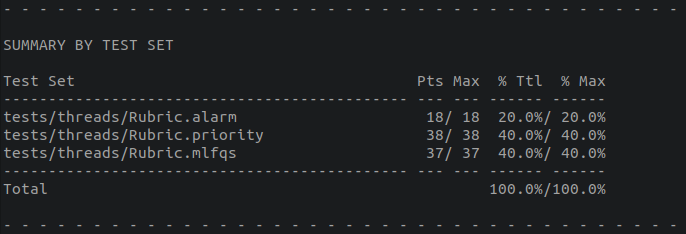
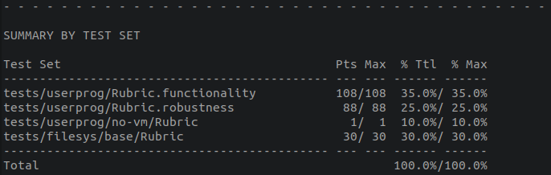
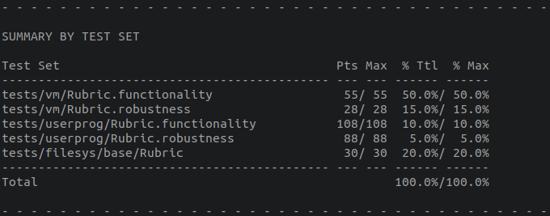
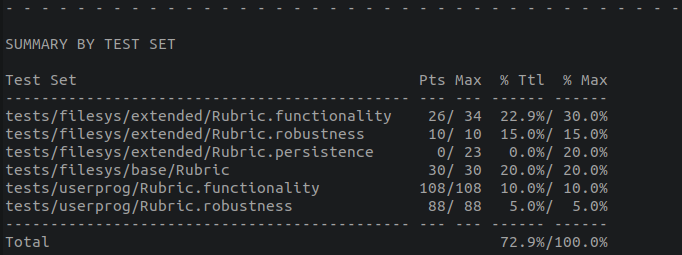

## 分工：

Project1 & 2： 计家宝

## 架构
### Project1 threads：

​	对于sleep，给thread结构体添加了wake_tick域，表示thread从sleep中应该被唤醒的时间，sleepelem域用于sleep队列的元素维护。对于priority的维护，在thread中维护当前thread拥有的锁，和现在正在等待的锁，在timer等函数里按优先级维护ready队列。对于mlfqs算法，按pintosbook方案添加nice_val,recent_cpu域，fixed_point.c用作假实数库函数。

### Project2 userprog：

​	为了保证父线程会为子线程收尸，包括异常退出，提前退出，先于父进程结束的子进程等种种情况，新建了process_control_block的结构体。在process_execute时为每一个进程从内核申请一页用于pcb，用sema_syncPaSon这个信号量保证父线程等待子线程start_process运行完成后继续运行，sema_waiting维护process_wait关系。对于非orphan的线程，父线程退出时为其回收pcb的空间，对于orphan进程，自己退出时回收自己的pcb空间。child_fail_load表示子进程load失败无法成功运行。retVal用于父进程回收子进程返回值。

## Grade：

​	threads: [link](#src/threads/build/grade)

​	userprog: [link](#src/userprog/build/grade)
    

​	virtualmemory: [link](#src/vm/build/grade)
    

​	filesystem: [link](#src/filesys/build/grade)
    

